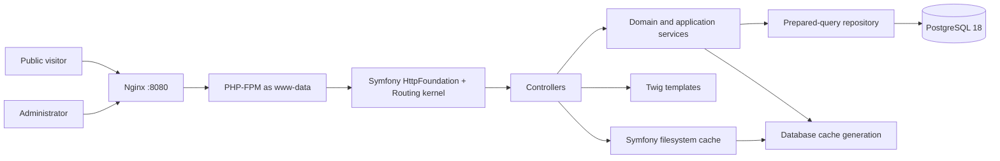
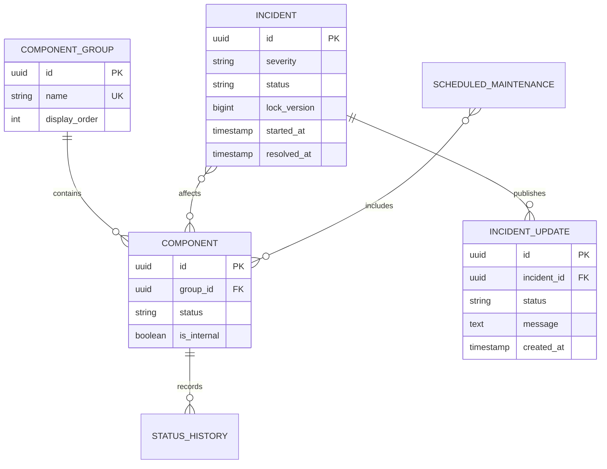

# Operational Status Management

[](https://github.com/German4341374/operational-status-management/actions/workflows/ci.yml)
[](LICENSE)

Operational Status Management is a compact status-management application for public and internal services. Operators organize components, publish incident timelines and maintenance windows, while customers receive a cached public status page, JSON API, status history, and RSS feed.

The application records subscriptions but deliberately sends no email. Subscriber addresses are normalized and converted to keyed HMAC hashes before persistence, so the original address cannot be recovered from the database.

## Features

- Public and internal component catalog with ordered component groups
- Incident severity, lifecycle, affected components, and immutable updates
- Scheduled maintenance and 90-day component uptime statistics
- Automatic component and overall status calculation
- Public status page, incident history, RSS, health endpoint, and REST API
- Session-based administrator authentication with password hashing
- CSRF protection, strict session cookies, login rate limiting, and security headers
- Append-only audit log and immutable incident-update database triggers
- Optimistic incident updates and transactional component-state reconciliation
- Versioned public-page caching with race-safe invalidation
- Transactional PostgreSQL migrations with checksums and an advisory lock
- PHPStan level 8, PHP-CS-Fixer, PHPUnit, dependency audit, and GitHub Actions

## Architecture



Nginx is the only published container. PHP-FPM is reachable only on the Compose edge network and PostgreSQL only on an internal data network. See [architecture details](docs/architecture.md).

## Data model



## Status consistency

An incident write is one PostgreSQL transaction:

1. lock and validate the incident and its optimistic version;
2. append an immutable update;
3. change the incident lifecycle state;
4. recompute every affected component from all active incidents;
5. append status history and audit evidence;
6. increment the public cache generation;
7. commit everything together.

The most severe active incident controls a component: Minor → Degraded, Major → Partial Outage, Critical → Major Outage. Active maintenance applies only when no incident causes a worse state. The overall page status is the worst visible component state. A rollback leaves the incident, components, audit log, and cache generation unchanged.

## Technology

- PHP 8.5 and Composer 2.10
- Symfony 8.1 components: HttpFoundation, Routing, Security CSRF, PasswordHasher, RateLimiter, and Cache
- Twig 3.28 and Monolog 3
- PostgreSQL 18.4
- Nginx 1.29 and PHP-FPM
- PHPUnit 13, PHPStan 2, and PHP-CS-Fixer 3
- Docker Compose and GitHub Actions

Exact application dependencies are locked in `composer.lock`; important container tags and Actions are pinned.

## Quick start

Prerequisites: Docker Engine with Compose v2 and Git. On Windows, use WSL2 with Docker Desktop integration.

```bash
git clone https://github.com/German4341374/operational-status-management.git
cd operational-status-management
cp .env.example .env
```

Replace `APP_SECRET` and `POSTGRES_PASSWORD`. Generate a new admin hash instead of retaining the demo hash:

```bash
make password-hash
# Copy the resulting hash into ADMIN_PASSWORD_HASH in .env.
docker compose up --build --detach --wait
```

Open:

- Public page: <http://localhost:8080>
- Admin page: <http://localhost:8080/admin>
- API status: <http://localhost:8080/api/status>
- RSS: <http://localhost:8080/feed.xml>

The `.env.example` credential (`admin` / `ChangeMe-Local-Only-2026`) is development-only. Replace its hash before any shared deployment.

Stop without deleting the database:

```bash
docker compose down
```

Delete all local data:

```bash
docker compose down --volumes
```

## Local PHP development

PHP 8.5, Composer, and a PostgreSQL 18 database are required.

```bash
composer install
cp .env.example .env
php bin/migrate.php
php -S 127.0.0.1:8080 -t public public/router.php
```

## REST API

| Method | Path | Purpose |
|---|---|---|
| GET | `/health` | Database-aware health check |
| GET | `/api/status` | Overall status, groups, incidents, and maintenance |
| GET | `/api/components` | Public components |
| GET | `/api/incidents` | Recent public incidents and immutable updates |
| POST | `/api/subscriptions` | Store an HMAC subscriber hash; no delivery |

```bash
curl --fail http://localhost:8080/api/status

curl --fail-with-body -X POST http://localhost:8080/api/subscriptions \
  -H 'Content-Type: application/json' \
  -d '{"email":"demo.user@example.invalid","scope":"all"}'
```

The API returns public components only. Invalid requests use `application/problem+json`. Administrative mutations intentionally remain session-authenticated form endpoints so that the compact project has one well-defined authentication and CSRF boundary.

## Verification

```bash
composer validate --strict
composer lint
composer analyse
composer audit --locked --no-interaction
composer test
php bin/migrate.php
php bin/migrate.php
php bin/database-smoke.php
docker compose config
docker compose build
```

GitHub Actions executes the complete sequence against PostgreSQL, uploads JUnit results, builds both images without publishing them, starts the complete Compose stack, waits for health checks, and exercises the public page, API, RSS feed, and subscription endpoint.

## Caching strategy

Only fully rendered public `/` HTML is cached. API, admin, health, RSS, and history responses are uncached. The cache key contains a generation stored in PostgreSQL. Every status-affecting write increments that generation inside the same transaction as the domain change.

A render reads the generation before and after Twig rendering. If invalidation races with rendering, the stale result is returned to the request already in progress but is not stored. Future requests select the new generation immediately. Old filesystem entries expire naturally and cannot be selected by a newer generation. Details and trade-offs are in [architecture.md](docs/architecture.md).

## Security boundaries

- Public routes expose no internal components or raw subscriber identifiers.
- Admin credentials live only in environment variables; passwords use Symfony's adaptive password hasher.
- Successful login rotates the session ID. Cookies are HttpOnly, SameSite Strict, strict-mode, and Secure when `SESSION_SECURE=true`.
- Login attempts use a fixed-window limiter keyed by a hash of the client address.
- All state-changing admin forms, login, and logout validate intent-specific CSRF tokens.
- Twig autoescaping, prepared PDO statements, CSP, frame denial, and content-type protection are enabled.
- Nginx and PHP-FPM run as non-root users with read-only filesystems and dropped capabilities.
- Audit and incident update rows cannot be changed or deleted through normal database statements.

This project does not implement user registration, roles, outbound notifications, or a trusted-proxy configuration. Do not expose it directly to the internet without TLS, trusted proxy/IP handling, secret management, and centralized authorization. See [security boundaries](docs/security-boundaries.md).

## Migration failure recovery

Each migration runs in its own transaction. On failure, the transaction rolls back and the version is not inserted into `schema_migrations`. The process exits before PHP-FPM starts. Applied migration checksums cannot silently change.

Do not edit a migration already applied to a shared environment. Diagnose the failing statement against a disposable copy, restore from a tested backup if a non-transactional external action was involved, and add a forward-only corrective migration. The complete procedure is in [migration recovery runbook](docs/runbooks/migration-recovery.md).

## Troubleshooting

- Compose reports missing variables: copy `.env.example`, then set `APP_SECRET`, `POSTGRES_PASSWORD`, and `ADMIN_PASSWORD_HASH`.
- Login loops: confirm `SESSION_SECURE=false` for local HTTP and `true` behind HTTPS.
- Application will not start: inspect `docker compose logs application database`; a migration failure intentionally prevents PHP-FPM startup.
- Public page appears stale: compare `cache_generations.generation` with application logs; never delete rows manually.
- Login rate limiting affects every user: configure trusted proxy handling before deployment so the application sees the real client address.
- Uptime differs from external monitoring: this metric is based on manually recorded component status, not synthetic probes.

## Known limitations

- One environment-defined admin account; no RBAC or identity provider integration
- Subscriptions are stored as irreversible hashes and no delivery is attempted
- File cache is local to each application instance; generation consistency is shared through PostgreSQL
- Maintenance activation is evaluated during component reconciliation; a scheduler would be needed for exact boundary transitions without an operator write
- Uptime is based on recorded state and treats planned maintenance as available
- Future work: OIDC, role separation, signed webhooks, Redis-backed cache, automatic maintenance scheduler, Prometheus metrics, localization, and accessibility audit

## Repository guide

- `src/Domain` — status severity, incident lifecycle, overall state, uptime
- `src/Service` — transactional application use cases
- `src/Repository` — prepared PostgreSQL queries and consistency operations
- `src/Security` — sessions, CSRF, hashing, and rate limiting
- `src/Cache` — database-versioned public page cache
- `migrations` — schema, immutability triggers, indexes, and fictional demo data
- `docker` — Nginx, PHP, and container startup configuration
- `tests` — 30 security, lifecycle, status, uptime, and caching tests

See [DEMO.md](DEMO.md) for a five-minute portfolio walkthrough.

## License

MIT License. See [LICENSE](LICENSE).
